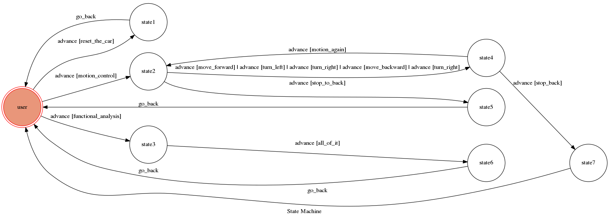

# Car-Assistant-Chatbot-Based-On-Telegram-
Car Assistant Chatbot
### Abilities
* command the vehicles based on finite state machine
* simple Natural Language processing
 
## Setup
### Prerequisite
* Python 2.7
#### Install Dependency
```sh
pip install -r requirements.txt
```
### Secret Data
`API_TOKEN` and `WEBHOOK_URL` in app.py **MUST** be set to proper values.
Otherwise, you might not be able to run your code.
### Run Locally
You can either setup https server or using `ngrok` as a proxy.
**`ngrok` would be used in the following instruction**
```sh
ngrok http 5000
```
After that, `ngrok` would generate a https URL.
You should set `WEBHOOK_URL` (in app.py) to `your-https-URL/hook`.
#### Run the sever
```sh
python app.py
```
## Finite State Machine

## Usage
This chatbot has the ability of natural language processing . Therefore ,  if the input text does not in the transition of finite state machine , it will respond you with 'perfunctory' words by package 'nltk'.

On the other hand, if the input text exists in the transition of finite state machine , it will act as follows.

The initial state is set to `user`. 
* Start in user
	* Input: "functional analysis"
	  ; Return: "Which parts?"
		*  Start in state3
		
			* Input: "all of it"
			  ; Return: "Car is functional"
			  	* Back to user
				
	* Input: "reset the car"
	  ; Return: "Reset is complete..."
		* Back to user
	
	* Input: "motion control"
	  ; Return: "What to do next?"
		* Start in state2
		
			* Input: "move forward" or "turn left" or "turn right" or "move backward"
			  ; Return: "Then?"
				*  Start in state4
				
					* Input: "again"
					  ; Return: "What to do next?"
						* Back to state2
						
					* Input: "stop"
					  ; Return: "Back to home"
						* Back to user
						
			* Input "stop"
			  ; Return: "Back to home"
				* Back to user
## Author
[a3794110](https://github.com/a3794110)
